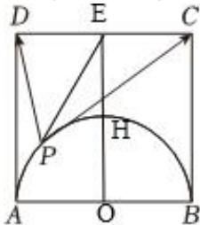

> [!faq]- 2024-2025学年内蒙古赤峰四中高一（下）月考数学试卷（5月份）解析
>
> > [!success]- **【答案】** [0,16]
>
> > [!note]- **【解析】**
> > 取 $CD$ 的中点 $\pmb{E}$ ，连接 $PE$
> >
> > 
> >
> > 则 $\overrightarrow{PC} +\overrightarrow{PD} = 2\overrightarrow{PE},\overrightarrow{PC} -\overrightarrow{PD} = \overrightarrow{DC} = 2\overrightarrow{DE}$
> >
> > 两式分别平方再相减得 $\overrightarrow{PC} \bullet \overrightarrow{PD} = \overrightarrow{PE}^2 - \overrightarrow{DE}^2 = |\overrightarrow{PE}|^2 - 4$
> >
> > 设 $AB$ 中点为 $O$ ，连接 $OE$ 交圆弧于点 $H$ ，则当 $P$ 与 $H$ 重合时， $PE$ 最小，最小值为2，
> >
> > 当 $P$ 与 $A$ 或 $B$ 重合时， $PE$ 最大，最大值为 $\sqrt{4^2 + 2^2} = 2\sqrt{5}$
> >
> > $$
> > \overrightarrow {P C} \bullet \overrightarrow {P D} \in [ 2 ^ {2} - 4, (2 \sqrt {5}) ^ {2} - 4 ] = [ 0, 1 6 ].
> > $$
> >
> > 故答案为：[0,16].
