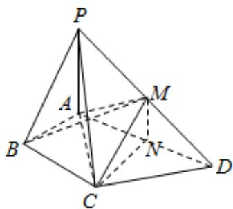

> [!faq]- 2024-2025学年内蒙古赤峰四中高一（下）月考数学试卷（5月份）解析
>
> > [!success]- **【答案】** 详见解析
>
> > [!note]- **【解析】**
> > 详见解析
> >
> > 证明：(1)∵M，N分别为PD，AD的中点，
> > ∴MN//PA.
> > 又∵MN≠平面PAB，PA⊂平面PAB，
> > ∴MN//平面PAB.
> > 在Rt△ACD中，∠CAD=60°，CN=AN，∴∠ACN=60°.
> > 又∵∠BAC=60°，∴CN//AB.
> > ∵CN≠平面PAB，AB⊂平面PAB，∴CN//平面PAB.
> > 又∵CN∩MN=N，∴平面CMN//平面PAB...（6分）
> >
> > (2) 由 (1) 知, 平面 $CMN \parallel$ 平面 $PAB$ ,
> >
> > 
> >
> > ∴点M到平面PAB的距离等于点C到平面PAB的距离.
> >
> > $$
> > A B = 1, \angle A B C = 9 0 ^ {\circ}, \angle B A C = 6 0 ^ {\circ}, \therefore B C = \sqrt {3}
> > $$
> >
> > $$
> > P - A B M
> > $$
> >
> > $$
> > V = V _ {M - P A B} = V _ {C - P A B} = V _ {P - A B C} = \frac {1}{3} \times \frac {1}{2} \times 1 \times \sqrt {3} \times 2 = \frac {\sqrt {3}}{3} \dots (1 2 \text {分})
> > $$
