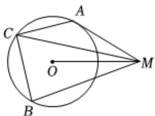

<!-- question-source:start -->
8、如图，A、B、C三点在半径为1的圆O上运动，且AC⊥BC，M是圆O外一点，OM=2，则 $\left|\overrightarrow{MA}+\overrightarrow{MB}+2\overrightarrow{MC}\right|$ 的最大值是（）

A 5
B 8
C 10
D 12
<!-- question-source:end -->

![[Q00091884A1]]
