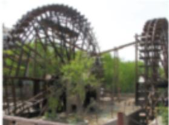
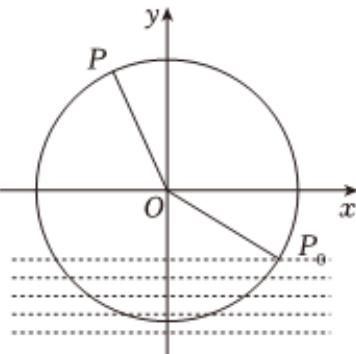

<!-- question-source:start -->
3、筒车是我国古代发明的一种水利灌溉工具，因其经济又环保，至今还在农业生产中得到应用。假定在水流稳定的情况下，筒车上的每一个盛水筒都做匀速圆周运动。如图，将筒车抽象为一个几何图形（圆），筒车半径为2.4m，筒车转轮的中心O到水面的距离为1.2m，筒车每分钟沿逆时针方向转动3圈。若规定：盛水筒M对应的点P从水中浮现（即 $P_{0}$ 时的位置）时开始计算时间，且以水轮的圆心O为坐标原点，过点O的水平直线为x轴建立平面直角坐标系xOy。设盛水筒M从点 $P_{0}$ 运动到点P时所经过的时间为t（单位：s），且此时点P距离水面的高度为h（单位：m）（在水面下则h为负数），则h与t的关系为

$h(t) = A\sin (\omega t + \varphi) + K(A > 0, \omega > 0, -\frac{\pi}{2} < \varphi < \frac{\pi}{2})$ . 下列说法正确的是（）

A $A = 2.4, \omega = \frac{\pi}{10}, \varphi = -\frac{\pi}{6}, K = 1.2$

B 点 $P$ 第一次到达最高点需要的时间为 $\frac{10}{3} s$

C 在转动的一个周期内，点 $P$ 在水中的时间是 $\frac{20}{3} s$

D 若 $h(t)$ 在 $[0, a]$ 上的值域为 $[0, 3.6]$ ，则 $a$ 的取值范围是 $\left[\frac{20}{3}, \frac{40}{3}\right]$
<!-- question-source:end -->

![[Q00091887A1]]
