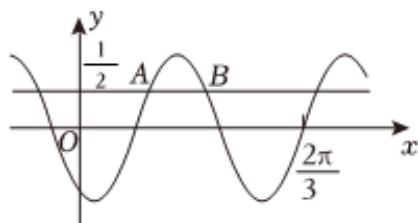

<!-- question-source:start -->
3、已知函数 $f(x)=\sin(\omega x+\varphi)$ ，如图，A，B是直线 $y=\frac{1}{2}$ 与曲线 $y=f(x)$ 的两个交点，若 $|AB|=\frac{\pi}{6}$ ，则 $f(\pi)=$ \_\_\_\_。

<!-- question-source:end -->

![[Q00091890A1]]
