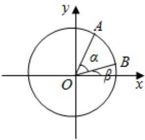

<!-- question-source:start -->
2、如图，在平面直角坐标系xOy中，以x为始边作两个锐角α，β，它们的终边分别与单位圆交于A，B两点.已知A，B的横坐标分别为 $\frac{\sqrt{5}}{5}$ ， $\frac{7\sqrt{2}}{10}$ .

(1)求 $\tan (\alpha +\beta)$ 的值；

(2)求 $2\alpha + \beta$ 的值.

<!-- question-source:end -->

![[Q00091892A1]]
