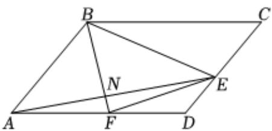

<!-- question-source:start -->
4、在平行四边形ABCD中，AB=4，AD=6， $\angle BAD=\frac{\pi}{3}$ ，F是线段AD的中点， $\overrightarrow{DE}=\lambda\overrightarrow{DC}$ ， $\lambda\in[-1,1]$ .

(1)若 $\lambda = \frac{1}{2}$ , $AE$ 与 $BF$ 交于点 $N$ , $\overrightarrow{AN} = x\overrightarrow{AB} + y\overrightarrow{AD}$ , 求 $x - y$ 的值;

(2)求 $\overrightarrow{BE}\cdot\overrightarrow{FE}$ 的最小值.

<!-- question-source:end -->

![[Q00092444A1]]
