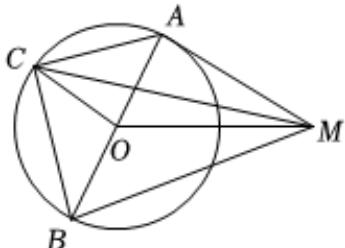

> [!faq]- 2024-2025学年内蒙古赤峰四中高一（下）第一次月考数学试卷解析
>
> > [!success]- **【答案】** C
>
> > [!note]- **【解析】**
> > 连接AB，如下图所示：
> >
> > 
> >
> > 因为 $AC \perp BC$ ，则 $AB$ 为圆 $O$ 的一条直径，故 $O$ 为 $AB$ 的中点，
> >
> > 所以， $\overrightarrow{MA} +\overrightarrow{MB} = (\overrightarrow{MO} +\overrightarrow{OA}) + (\overrightarrow{MO} +\overrightarrow{OB}) = 2\overrightarrow{MO}$
> >
> > 所以， $|\overrightarrow{MA} +\overrightarrow{MB} +2\overrightarrow{MC}| = |2\overrightarrow{MO} +2(\overrightarrow{MO} +\overrightarrow{OC})| = |4\overrightarrow{MO} +2\overrightarrow{OC} |\leq 4|\overrightarrow{MO}| + 2|\overrightarrow{OC} |$ $= 4\times 2 + 2\times 1 = 10$ ，
> >
> > 当且仅当 $M$ 、 $O$ 、 $C$ 共线且 $\overrightarrow{MO}$ 、 $\overrightarrow{OC}$ 同向时，等号成立，因此， $|\overrightarrow{MA} +\overrightarrow{MB} +2\overrightarrow{MC} |$ 的最大值为10.故选： $\pmb{C}$
