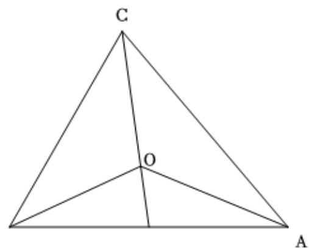

> [!faq]- 2024-2025学年内蒙古赤峰四中高一（下）第一次月考数学试卷解析
>
> > [!success]- **【答案】** CD
>
> > [!note]- **【解析】**
> > 对于A，若 $\overrightarrow{a}=(1,0)$ ， $\overrightarrow{b}=(0,1)$ ，满足 $|\overrightarrow{a}|=|\overrightarrow{b}|$ ，但不满足 $\overrightarrow{a}=\overrightarrow{b}$ 或 $\overrightarrow{a}=-\overrightarrow{b}$ ，故A错误；
> > 对于B，在平行四边形ABCD中， $\overrightarrow{AB}-\overrightarrow{AD}=\overrightarrow{DB}$ ，故B错误；
> > 对于C，在△ABC中，若 $\overrightarrow{AB}\cdot\overrightarrow{AC}<0$ ，则A为钝角，故△ABC是钝角三角形，故C正确；
> > 对于D，取AB的中点D，连接OD，则 $\overrightarrow{OA}+\overrightarrow{OB}=2\overrightarrow{OD}$ ，又 $\overrightarrow{OA}+\overrightarrow{OB}+\overrightarrow{OC}=\overrightarrow{0}$ ，故 $\overrightarrow{OC}=-2\overrightarrow{OD}$ ，所以点O是三角形的重心，故D正确.
> > 故选：CD
> >
> > 
