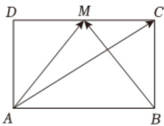

<!-- question-source:start -->
4、如图，在矩形ABCD中，M是CD的中点，则（）
A $\overrightarrow{AC} = \frac{3}{2}\overrightarrow{AM} - \frac{1}{2}\overrightarrow{BM}$ B $\overrightarrow{AC} = \frac{3}{2}\overrightarrow{AM} - \overrightarrow{BM}$

C $\overrightarrow{AC} = \overrightarrow{AM} -\frac{3}{2}\overrightarrow{BM}$ D $\overrightarrow{AC} = \frac{1}{2}\overrightarrow{AM} +\frac{1}{2}\overrightarrow{BM}$
<!-- question-source:end -->

![[Q00092449A1]]
