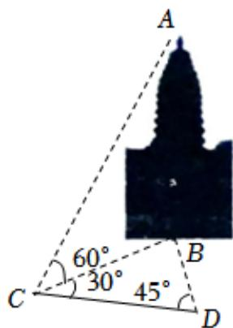

<!-- question-source:start -->
7、嵩岳寺塔位于河南郑州登封市嵩岳寺内，历经1400多年风雨侵蚀，仍巍然屹立，是中国现存最早的砖塔。如图，为测量塔的总高度AB，选取与塔底B在同一水平面内的两个测量基点C与D，现测得 $\angle BCD=30^{\circ}$ ， $\angle BDC=45^{\circ}$ ，CD=32m，在C点测得塔顶A的仰角为 $60^{\circ}$ ，则塔的总高度为（）

$$
(9 6 - 3 2 \sqrt {6}) m
$$

$$
(9 6 - 3 2 \sqrt {3}) m
$$

$$
(9 2 - 3 2 \sqrt {2}) m
$$

D $(92 - 32\sqrt{3})m$
<!-- question-source:end -->

![[Q00092452A1]]
