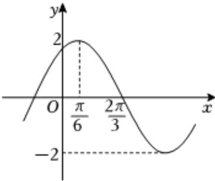

<!-- question-source:start -->
3. 已知函数 $f(x)=2\sin(\omega x+\varphi)(\omega>0,0<\varphi<\pi)$ 的部分图象如图所示.先将 $f(x)$ 图象上的每个点的横坐标变为原来的 $\frac{1}{2}$ （纵坐标不变），再将所得图象向右平移 $\frac{\pi}{4}$ 个单位长度，向下平移1个单位长度，得到函数 $g(x)$ 的图象.

1 求 $g(x)$ 的解析式；

2 已知 $\alpha, \beta$ 均为锐角， $f(\alpha - \frac{\pi}{3}) = \frac{8}{5}$ ， $\sin (\alpha - \beta) = -\frac{12}{13}$ ，求 $\sin (2\alpha - \beta)$ 的值.
<!-- question-source:end -->

![[Q00092462A1]]
