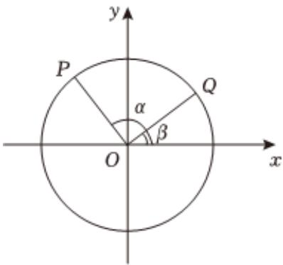

<!-- question-source:start -->
3、如图，以 $Ox$ 为始边作角 $\alpha$ 与 $\beta (0 < \beta < \frac{\pi}{2} < \alpha < \pi)$ ，它们的终边分别与单位圆相交于点 $P$ ， $Q$ ，已知点 $Q$ 的坐标为 $(x, \frac{\sqrt{5}}{5})$ ，

1 求 $\frac{2\sin\beta + 5\cos\beta}{3\sin\beta - 2\cos\beta}$ 的值；

2 若 $OP \perp OQ$ ，求P的坐标
<!-- question-source:end -->

![[Q00091915A1]]
