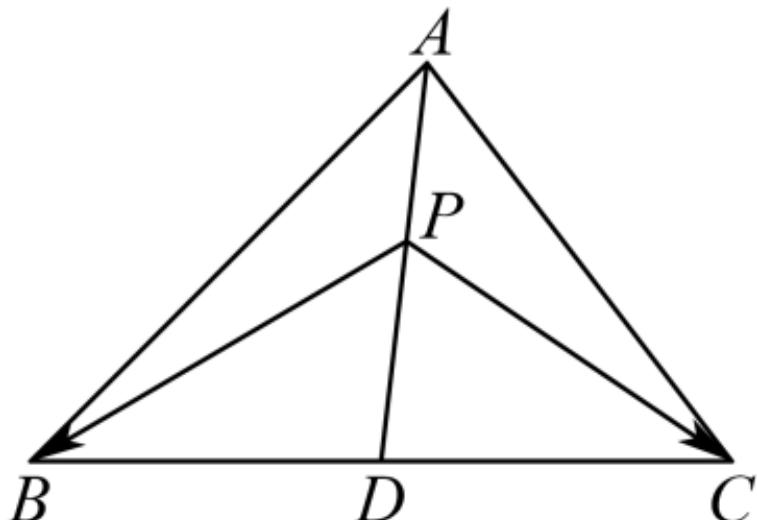

> [!faq]- 2024-2025学年内蒙古赤峰市曾军良实验学校（赤峰四中桥北新校）高一（下）期中数学试卷解析
>
> > [!success]- **【答案】** 8
>
> > [!note]- **【解析】**
> > 作出示意图如下：
> >
> > 
> >
> > 因为在 $\triangle ABC$ 中， $D$ 是 $BC$ 的中点， $AD=4$ ，
> >
> > 所以 $\overrightarrow{PB} +\overrightarrow{PC} = 2\overrightarrow{PD}$ ，设 $AP = x$ ， $x\in [0,4]$
> >
> > 则 $PD = 4 - x$
> >
> > $$
> > \overrightarrow {A P} \bullet (\overrightarrow {P B} + \overrightarrow {P C}) = \overrightarrow {A P} \bullet (2 \overrightarrow {P D}) = 2 \overrightarrow {A P} \bullet \overrightarrow {P D}
> > $$
> >
> > 当 $x = 0$ 时 $\overrightarrow{AP} = \overrightarrow{0}$ ，此时 $\overrightarrow{AP} \bullet (\overrightarrow{PB} + \overrightarrow{PC}) = 0$
> >
> > 当 $x = 4$ 时 $\overrightarrow{PD} = \overrightarrow{0}$ ，此时 $\overrightarrow{AP} \bullet (\overrightarrow{PB} + \overrightarrow{PC}) = 0$
> >
> > 当 $x \in (0,4)$ 时， $\overrightarrow{AP}$ 与 $\overrightarrow{PD}$ 共线同向，
> >
> > 所以 $\overrightarrow{AP} \bullet (\overrightarrow{PB} + \overrightarrow{PC}) = \overrightarrow{AP} \bullet (2\overrightarrow{PD}) = 2\overrightarrow{AP} \bullet \overrightarrow{PD} = 2x(4 - x)$
> >
> > 所以当 $x = 2$ 时， $\overrightarrow{AP}\bullet (\overrightarrow{PB} +\overrightarrow{PC})$ 的最大值为8.
> >
> > 故答案为：8.
