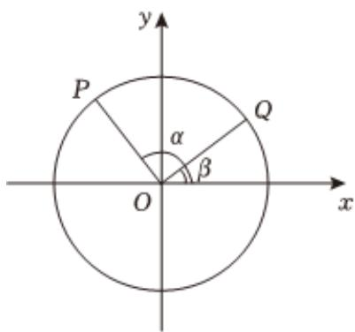

> [!faq]- 2024-2025学年内蒙古赤峰市曾军良实验学校（赤峰四中桥北新校）高一（下）期中数学试卷解析
>
> > [!success]- **【答案】** 详见解析
>
> > [!note]- **【解析】**
> > 详见解析
> >
> > （1）点 $Q$ 的坐标为 $(x, \frac{\sqrt{5}}{5})$ ，可得 $\sin \beta = \frac{\sqrt{5}}{5}$ ， $\cos \beta = \frac{2\sqrt{5}}{5}$ ，所以 $\frac{2\sin \beta + 5\cos \beta}{3\sin \beta - 2\cos \beta} = \frac{\frac{2\sqrt{5}}{5} + \frac{10\sqrt{5}}{5}}{\frac{3\sqrt{5}}{5} - \frac{4\sqrt{5}}{5}} = -12.$ (2) $\alpha = \frac{\pi}{2} + \beta$ ， $\cos \alpha = \cos (\frac{\pi}{2} + \beta) = -\sin \beta = -\frac{\sqrt{5}}{5}$ ， $\sin \alpha = \sin (\frac{\pi}{2} + \beta) = \cos \beta = \frac{2\sqrt{5}}{5}$ . $P$ 的坐标 $(- \frac{\sqrt{5}}{5}, \frac{2\sqrt{5}}{5})$
> >
> > 
