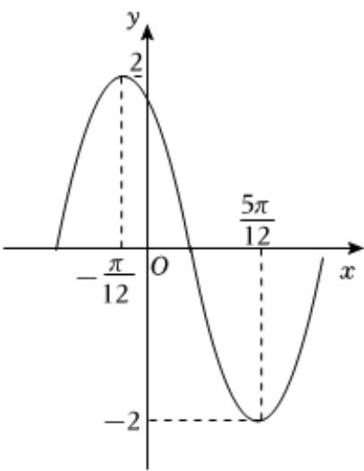

<!-- question-source:start -->
2、函数 $f(x)=A\sin(\omega x+\varphi)(A>0,\omega>0,0<\varphi<\pi)$ 在一个周期内的图象如图所示，则下列关于函数 $y=f(x)$ 的说法，正确的有（）

A $f(x)$ 的最小正周期 $T = \pi$ B $(\frac{\pi}{3},0)$ 是 $f(x)$ 的一个对称中心  
C在区间 $(- \frac{11\pi}{24}, \frac{13\pi}{24})$ 上的值域为 $(- \sqrt{2}, 2]$ D将函数 $f(x)$ 的图象向左平移 $\frac{5\pi}{12}$ 后得到 $g(x)$ 的图象，则 $g(x) = -2\cos 2x$
<!-- question-source:end -->

![[Q00091031A1]]
