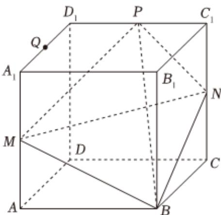

<!-- question-source:start -->
3、如图，在棱长为2的正方体 $ABCD-A_{1}B_{1}C_{1}D_{1}$ 中，M，N，P分别是 $AA_{1}$ ， $CC_{1}$ ， $C_{1}D_{1}$ 的中点，Q是线段 $D_{1}A_{1}$ 上的动点，则（）

A 存在点Q使PQ//平面MBN

B 直线 $MD_{1}$ 与平面 $BDD_{1}B_{1}$ 所成角的正弦值为 $\frac{\sqrt{15}}{5}$

C 三棱锥 $Q - BCN$ 的体积是定值

D 经过 $C, M, B, N$ 四点的球的表面积 $9\pi$
<!-- question-source:end -->

![[Q00091032A1]]
