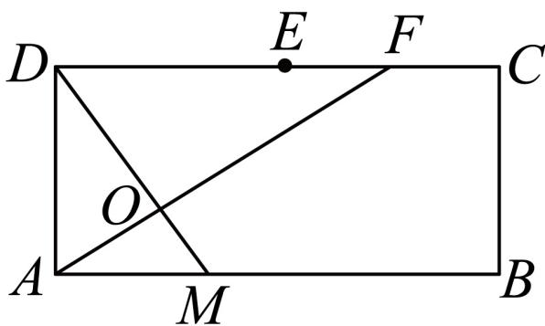
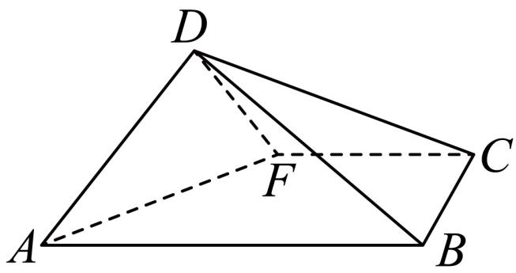

<!-- question-source:start -->
5、如图

(1)，在矩形ABCD中， $AB = 2$ $\dot{A} D = 1$ ，点E为CD的中点，F为

  
图(1)

  
图(2)

线段CE上一动点.过点D作DO⊥AF于点O，DO的延长线交AB于点M.

(1)求 $|DO|$ 的取值范围（只需写出结果，无需推理过程）；

(2)现将 $\triangle DAF$ 沿 $AF$ 折起，使得平面 $ABD \perp$ 平面 $ABCF$ .

(i)当点 $F$ 为线段 $CE$ 的中点时，求二面角 $D - AF - B$ 平面角的余弦值；

(ii)设直线 $FD$ 与平面 $ABCF$ 所成角为 $\theta$ ，求 $\theta$ 的最大值.
<!-- question-source:end -->

![[Q00091040A1]]
