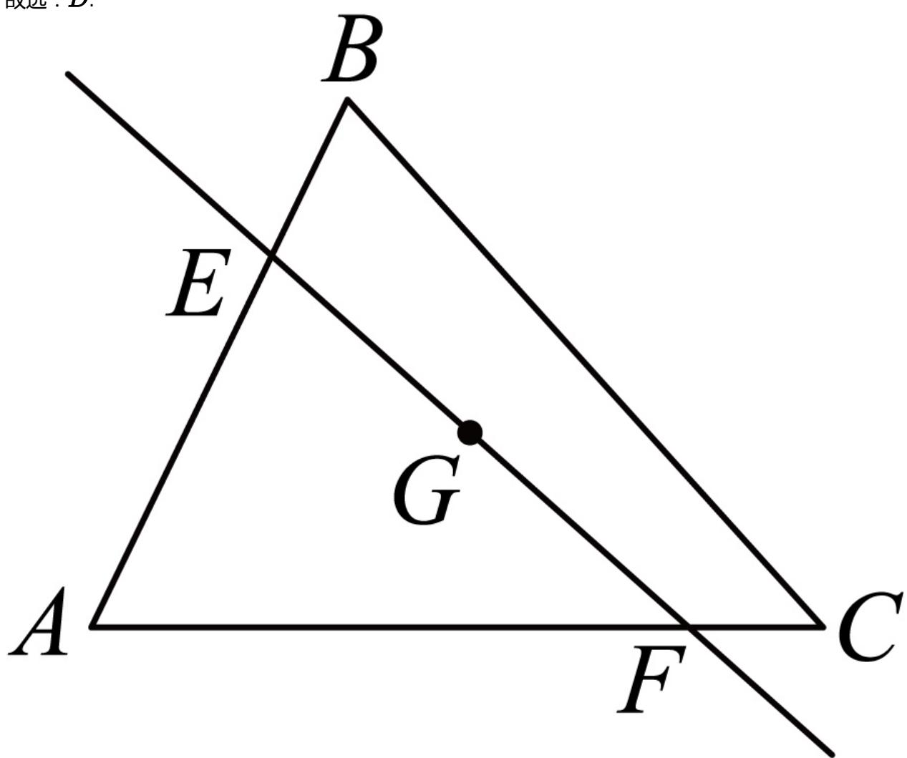

> [!faq]- 2024-2025学年内蒙古赤峰市高一（下）期末数学试卷解析
>
> > [!success]- **【答案】** D
>
> > [!note]- **【解析】**
> > 已知 $G$ 是 $\triangle ABC$ 的重心，过点 $G$ 的直线 $l$ 与线段 $AB$ 、 $AC$ 分别交于点 $E$ 、 $F$ ，
> >
> > $$
> > \overrightarrow {A E} = \lambda \overrightarrow {A B}, \overrightarrow {A F} = \mu \overrightarrow {A C}, (\lambda > 0, \mu > 0)
> > $$
> >
> > 根据重心的性质，重心是三角形三条中线的交点，且重心到顶点的距离是它到对边中点距离的2倍.
> >
> > 所以 $\overrightarrow{AG} = \frac{2}{3}\times \frac{1}{2} (\overrightarrow{AB} +\overrightarrow{AC}) = \frac{1}{3} (\overrightarrow{AB} +\overrightarrow{AC}).$
> >
> > 因为 $\overrightarrow{AE} = \lambda \overrightarrow{AB},\overrightarrow{AF} = \mu \overrightarrow{AC}$ ，所以 $\overrightarrow{AB} = \frac{1}{\lambda}\overrightarrow{AE},\overrightarrow{AC} = \frac{1}{\mu}\overrightarrow{AF}.$
> >
> > 所以 $\overrightarrow{AG} = \frac{1}{3} (\overrightarrow{AB} +\overrightarrow{AC}) = \frac{1}{3\lambda}\overrightarrow{AE} +\frac{1}{3\mu}\overrightarrow{AF}.$
> >
> > 因为 $E, G, F$ 三点共线，根据向量共线定理可得 $\frac{1}{3\lambda} + \frac{1}{3\mu} = 1$ ，化简得 $\frac{1}{\lambda} + \frac{1}{\mu} = 3.$
> >
> > $$
> > 2 \lambda + 8 \mu = \frac {1}{3} (2 \lambda + 8 \mu) (\frac {1}{\lambda} + \frac {1}{\mu}) = \frac {1}{3} (2 + 8 + \frac {2 \lambda}{\mu} + \frac {8 \mu}{\lambda}) \geq \frac {1}{3} (1 0 + 2 \sqrt {\frac {2 \lambda}{\mu} \times \frac {8 \mu}{\lambda}}) = 6.
> > $$
> >
> > 当且仅当 $\frac{2\lambda}{\mu} = \frac{8\mu}{\lambda}$ 时，即 $\lambda = 2\mu$ 时等号成立，此时 $2\lambda + 8\mu$ 的最小值为6.
> >
> > 故选：D.
> >
> > 
