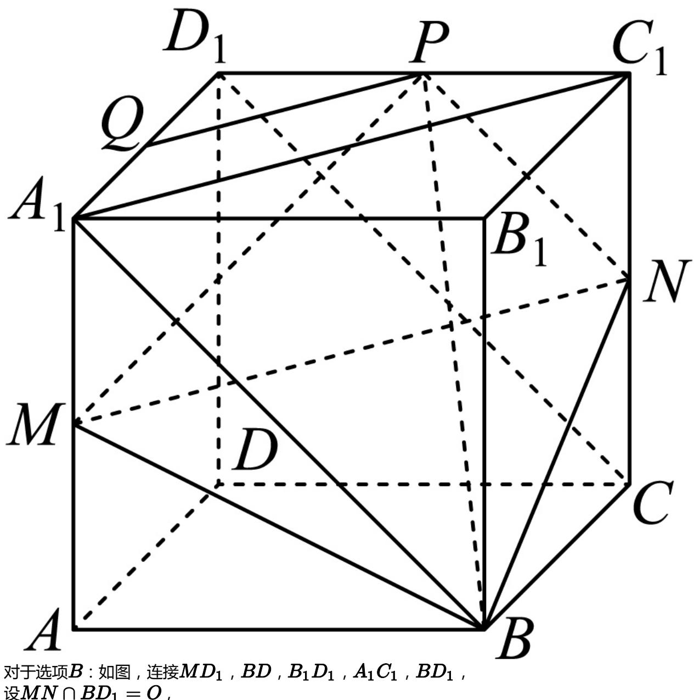
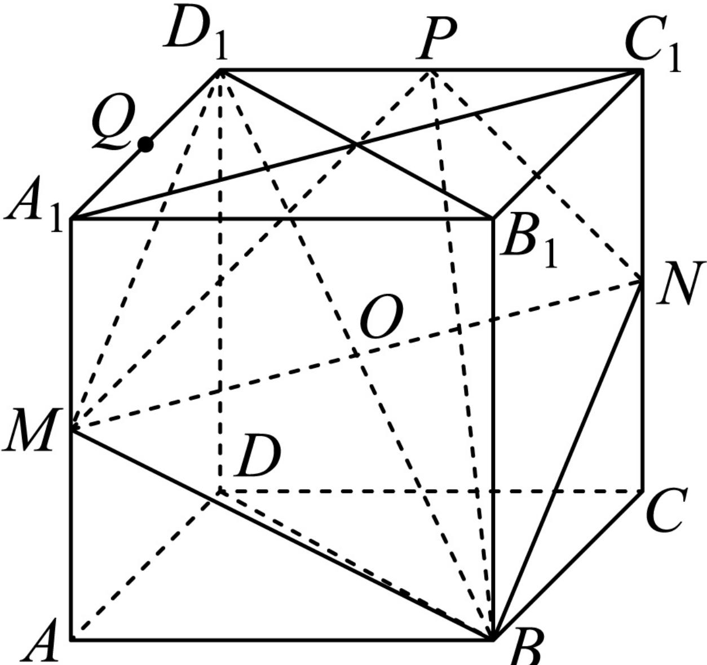
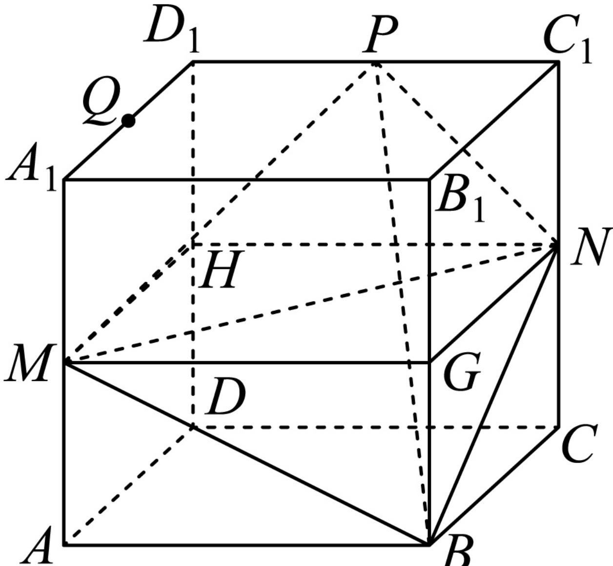

> [!faq]- 2024-2025学年内蒙古赤峰市高一（下）期末数学试卷解析
>
> > [!success]- **【答案】** ACD
>
> > [!note]- **【解析】**
> > 对于选项A：连接PQ， $A_{1}C_{1}$ ，当Q是 $D_{1}A_{1}$ 的中点时，
> >
> > $$
> > \because P Q \parallel A _ {1} C _ {1}, A _ {1} C _ {1} \parallel M N, \therefore P Q \parallel M N.
> > $$
> >
> > ∵ MN ⊂ 平面 BMN, PQ ≠ 平面 BMN, ∴ PQ // 平面 BMN, 故 A 选项正确；
> >
> >   
> > 对于选项 $B$ ：如图，连接 $MD_{1}$ ， $BD$ ， $B_{1}D_{1}$ ， $A_{1}C_{1}$ ， $BD_{1}$ 设 $MN\cap BD_1 = O$
> >
> > 
> >
> > $\because M, N$ 分别是 $AA_{1}, CC_{1}$ 的中点， $\therefore A_{1}C_{1} \parallel MN$ 根据正方体的性质可知 $DD_{1} \perp$ 平面 $A_{1}B_{1}C_{1}D_{1}, A_{1}C_{1} \subset$ 平面 $A_{1}B_{1}C_{1}D_{1}$ ， $\therefore DD_{1} \perp A_{1}C_{1}$ ，又 $B_{1}D_{1} \perp A_{1}C_{1}, B_{1}D_{1} \cap DD_{1} = D_{1}, B_{1}D_{1}, DD_{1} \subset$ 平面 $BDD_{1}B_{1}$ ， $\therefore A_{1}C_{1} \perp$ 平面 $BDD_{1}B_{1}, \therefore MN \perp$ 平面 $BDD_{1}B_{1}$ ， $\therefore D_{1}O$ 为直线 $MD_{1}$ 在平面 $BDD_{1}B_{1}$ 的射影， $\therefore \angle MD_{1}O$ 即为所求的线面角，在 $Rt \triangle MD_{1}O$ 中， $MD_{1} = \sqrt{2^{2} + 1^{2}} = \sqrt{5}, MO = \frac{1}{2} A_{1}C_{1} = \sqrt{2}$ ， $\therefore sin \angle MD_{1}O = \frac{MO}{MD_{1}} = \frac{\sqrt{2}}{\sqrt{5}} = \frac{\sqrt{10}}{5}$ ，故 $B$ 选项错误；对于选项 $C: \because ABCD - A_{1}B_{1}C_{1}D_{1}$ 为正方体， $\therefore D_{1}A_{1} \parallel$ 平面 $BCN$ 直线 $D_{1}A_{1}$ 上的点到面 $BCN$ 的距离为2，而 $S_{\triangle BCN} = 1$ ， $\therefore V_{Q-BCN} = \frac{2}{3}$ 是定值，故 $C$ 选项正确；对于选项 $D$ ：设 $G, H$ 分别为 $BB_{1}, DD_{1}$ 的中点，
> >
> > 
> >
> > 则ABCD-MGNH为长宽高分别为2，2，1的长方体，
> >
> > 根据分割补形法知：经过 $C$ ， $M$ ， $B$ ， $N$ 四点的球即为长方体ABCD－MGNH的外接球，所求球的直径2R满足： $(2R)^{2} = 2^{2} + 2^{2} + 1^{2} = 9$
> >
> > 经过四点 $C$ ， $M$ ， $B$ ， $N$ 的球的表面积为 $4\pi R^2 = 9\pi$ ，故 $D$ 选项正确
> >
> > 故选：ACD.
