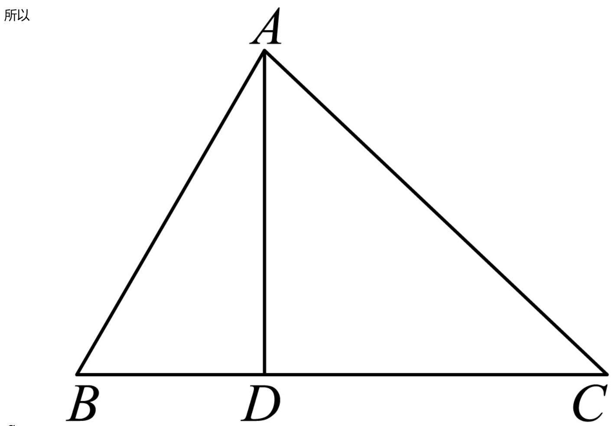

> [!faq]- 2024-2025学年内蒙古赤峰市高一（下）期末数学试卷解析
>
> > [!success]- **【答案】** 详见解析
>
> > [!note]- **【解析】**
> > 详见解析
> >
> > 证明：（1）由题意， $\triangle ABC$ 中， $a, b, c$ 分别为角 $A, B, C$ 的对边，如图所示，过点 $A$ 作 $AD \perp BC$ 垂足为 $D$ ，
> >
> > 则AD = b sin C
> >
> > 所以
> >
> > 
> >
> > $$
> > = \frac {1}{2} B C
> > $$
> >
> > $$
> > = \frac {1}{2} a b s i n C
> > $$
> >
> > $$
> > \begin{array}{l} \text {即} S _ {\triangle A B C}, p = \frac {1}{2} (a \\ = \frac {1}{2} a b s i n C + b + c) \end{array}
> > $$
> >
> > $$
> > S _ {\triangle A B C} ^ {2}
> > $$
> >
> > $$
> > = \frac {1}{4} a ^ {2} b ^ {2} \sin^ {2} C
> > $$
> >
> > $$
> > = \frac {1}{4} a ^ {2} b ^ {2}
> > $$
> >
> > $$
> > = \frac {1}{4} a ^ {2} b ^ {2} [ 1 - \left(\frac {a ^ {2} + b ^ {2} - c ^ {2}}{2 a b}\right) ^ {2} ]
> > $$
> >
> > $$
> > \begin{array}{r l} & {{= \frac {1}{4} a ^ {2} b ^ {2} \times \frac {\left(2 a b\right) ^ {2} - \left(a ^ {2} + b ^ {2} - c ^ {2}\right) ^ {2}}{4 a ^ {2} b ^ {2}}}} \\ & {{= \frac {1}{1 6} (2 a b - a ^ {2} - b ^ {2} + c ^ {2}) (2 a b + a ^ {2} + b ^ {2} - c ^ {2})}} \\ & {{= \frac {1}{1 6} [ c ^ {2} - (a - b) ^ {2} ] [ (a + b) ^ {2} - c ^ {2} ]}} \\ & {{= \frac {1}{1 6} (b + c - a) (a + c - b) (a + b - c) (a + b + c)}} \\ & {{= p \left(p - a\right) \left(p - b\right) \left(p - c\right),}} \\ & {{\therefore S _ {\triangle A B C} = \sqrt {p (p - a) (p - b) (p - c)}, \mathrm{得证}.}} \end{array}
> > $$
