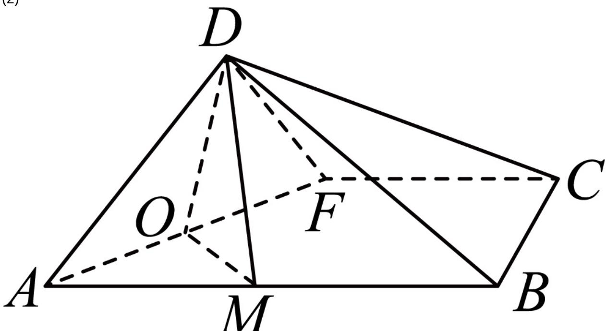
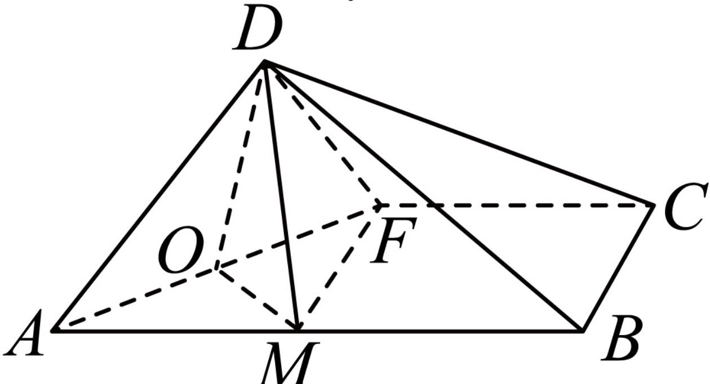

> [!faq]- 2024-2025学年内蒙古赤峰市高一（下）期末数学试卷解析
>
> > [!success]- **【答案】** 详见解析
>
> > [!note]- **【解析】**
> > 详见解析
> >
> > (1) 若令 $\angle DFA = \alpha$ ，因此 $\angle ADO = \angle OAM = \angle DFA = \alpha$ ，因此 $|DO| = |DA| \cos \alpha = \cos \alpha$ ，
> >
> > 当点 $F$ 与点 $E$ 重合时， $\cos \alpha = \cos \frac{\pi}{4} = \frac{\sqrt{2}}{2}$
> >
> > 当点 $F$ 与点 $C$ 重合时， $AC = \sqrt{AB^2 + BC^2} = \sqrt{5}$ ，因此cosα = $\frac{DC}{AC} = \frac{2}{\sqrt{5}} = \frac{2\sqrt{5}}{5}$ ，
> >
> > 因此 $|DO|=cos\alpha\in\left[\frac{\sqrt{2}}{2},\frac{2\sqrt{5}}{5}\right]$ ;
> >
> > (2)
> >
> > 
> >
> > (i)连接DM，由已知得， $AF \perp$ 面ODM，故 $AF \perp DM①$ 又平面 $ABD \perp$ 平面 $ABCF$ ，平面 $ABD \cap$ 平面 $ABCF = AB, CB \perp AB$ ，因此 $CB \perp$ 平面 $ABD, DM \subset$ 平面 $ABD$ ，因此 $CB \perp DM$ ②，由①、②及 $AF$ 与 $CB$ 相交，得 $DM \perp$ 面 $ABCF$ ，
> >
> > 因此 $\angle ODM$ 二面角 $D - AF - B$ 的平面角，
> >
> > 由（1）知， $|OA|=\sin\alpha,\left|OM\right|=\sin\alpha\cdot\tan\alpha,$
> >
> > 因此 $\cos\angle ODM=\frac{|OM|}{|OD|}=\tan^{2}\alpha$
> >
> > 当点 $F$ 为线段 $CE$ 的中点时，由 $AD = 1$ ， $AF = \frac{3}{2}$ ，因此 $\tan \alpha = \frac{2}{3}$
> >
> > 故 $cos\angle ODM=tan^{2}\alpha=\frac{4}{9}$
> >
> > 因此二面角 $D - AF - B$ 的平面角的余弦值为 $\frac{4}{9}$ .
> >
> > 
> >
> > (ii)连接FM，由DM⊥面ABCF，知直线FD与平面ABCF所成角为∠DFM=θ
> >
> > $$
> > \sin^ {2} \theta = \frac {D M ^ {2}}{D F ^ {2}} = \frac {O D ^ {2} - O M ^ {2}}{D F ^ {2}} = \tan^ {2} \alpha (\cos^ {2} \alpha - \sin^ {2} \alpha \bullet \tan^ {2} \alpha)
> > $$
> >
> > 令 $tan^{2}\alpha=t\in\left[\frac{1}{4},1\right]$ ,
> >
> > $$
> > \sin^ {2} \theta = t \left[ \frac {1}{1 + t} - t \left(1 - \frac {1}{1 + t}\right) \right] = t (1 - t) \leq \left(\frac {t + 1 - t}{2}\right) ^ {2} = \frac {1}{4},
> > $$
> >
> > 由 $\theta \in [0, \frac{\pi}{2})$ ，且 $sin\theta \leq \frac{1}{2}$ 得， $\theta_{max} = \frac{\pi}{6}$ ，
> >
> > 当且仅当 $t = 1 - t$ ，因此 $t = \frac{1}{2} \in [\frac{1}{4}, 1]$ 时，取到最大值.
