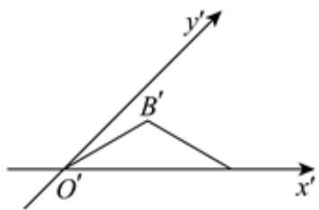

<!-- question-source:start -->
5、由斜二测画法得到的一个水平放置的三角形的直观图是等腰三角形，底角为 $30^{\circ}$ ，腰长为2，如图，那么它在原平面图形中，顶点 $B'$ 到 $x$ 轴的距离是（）

A 1

B 2
C $\sqrt{2}$ D $2\sqrt{2}$
<!-- question-source:end -->

![[Q00091063A1]]
