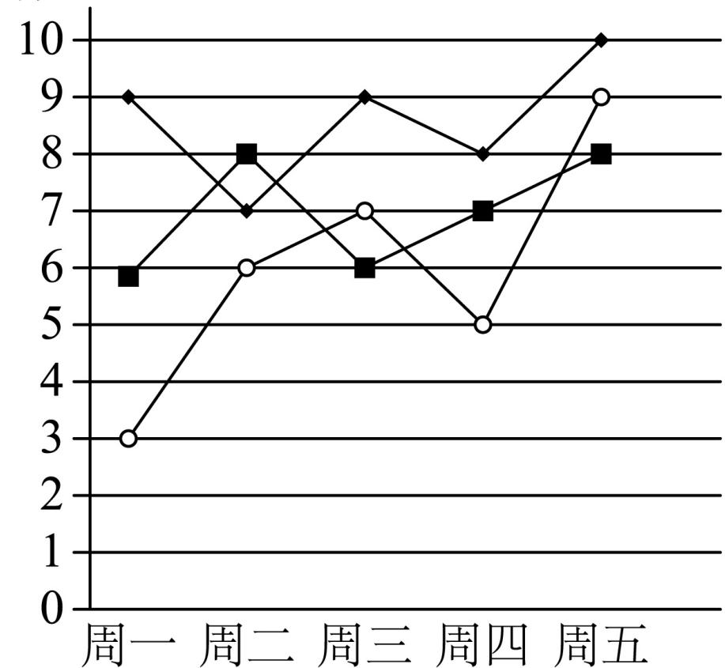

<!-- question-source:start -->
2、某学校得分在教育教

在教育教学管理中，采用量化评分的方式进行管理，其中高一某班在一周中的纪律、卫生及两操的日量化得分（得分均为整数）折线图如图所示，则在这五天中（）

A 纪律的平均分最高  
B 与纪律、卫生相比，两操的第80百分位数最大  
C 卫生的方差最小  
D 周四的班级量化总得分最低
<!-- question-source:end -->

![[Q00091068A1]]
