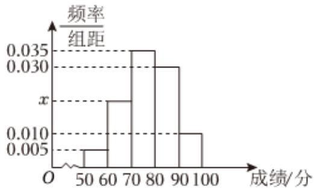

<!-- question-source:start -->
2. 某社区组织了300人参加读书有奖测试活动，参与者经过一段时间的读书学习之后，参加社区组织的测试。把他们的测试成绩（满分100分）整理后绘制成如图所示的频率分布直方图，所有成绩共分为[50,60)，[60,70)，[70,80)，[80,90)，[90,100]五组。

## 1 求x的值；

2 估计这300人测试成绩的平均数；(每组数据以该组所在区间的中点值为代表)

在测试成绩为[60, 70)，[70, 80)，[80, 90)，[90, 100]的四组人中，按人数比例用分层随机抽样的方法抽取57人，求在测试成绩为[80, 90)的这一组中抽取的人数.
<!-- question-source:end -->

![[Q00092466A1]]
