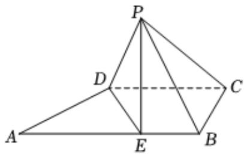

<!-- question-source:start -->
4. 如图，直角梯形ABCD中， $AB \parallel CD$ ， $AB \perp BC$ ，E为AB上的点，且AD = AE = DC = 2，BE = 1，将△ADE沿DE折叠到P点，使PC = PB.

1 求证：平面PDE⊥平面ABCD；

2 求四棱锥P-EBCD的体积.

<!-- question-source:end -->

![[Q00092468A1]]
