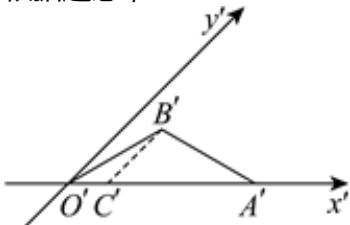

> [!faq]- 2024-2025学年内蒙古通辽市高一（下）期末数学试卷解析
>
> > [!success]- **【答案】** D
>
> > [!note]- **【解析】**
> > 根据题意，
> >
> > 
> >
> > 如图，过点 $B'$ 作 $B'C'' \parallel y''$ 轴，交 $x''$ 轴于点 $C'$
> >
> > 在 $\triangle O^{\prime}B^{\prime}C^{\prime}$ 中， $\angle B^{\prime}O^{\prime}C^{\prime}=30^{\circ}$ ， $\angle B^{\prime}C^{\prime}O^{\prime}=135^{\circ}$ ， $O^{\prime}B^{\prime}=2$
> >
> > 由正弦定理得 $\frac{B'C'}{sin30^\circ} = \frac{O'B'}{sin135^\circ}$
> >
> > 于是得 $B^{\prime}C^{\prime}=\sqrt{2}$ ，且原图中BC即为B到x轴的距离，
> >
> > 由斜二测画法规则知，在原平面图形中，顶点B到x轴的距离是 $2\sqrt{2}$ .
> >
> > 故选：D.
