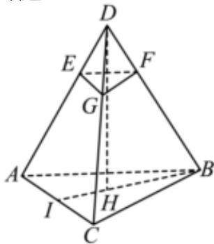

> [!faq]- 2024-2025学年内蒙古通辽市高一（下）期末数学试卷解析
>
> > [!success]- **【答案】** A
>
> > [!note]- **【解析】**
> > 如图，根据题意可得所得棱台为正三棱台，
> >
> > 该棱台的高等于大正三棱锥的高的 $\frac{2}{3}$ 倍，
> >
> > 设大正三棱锥的高为 $DH$ ，则： $BH = \frac{2}{3} BI = \frac{2}{3}\times 3\sqrt{3} = 2\sqrt{3}$
> >
> > 因为大正三棱锥的高为： $DH = \sqrt{DB^2 - BH^2} = \sqrt{6^2 - (2\sqrt{3})^2} = 2\sqrt{6}$
> >
> > 所以该棱台的高为 $\frac{2}{3} \times 2\sqrt{6} = \frac{4\sqrt{6}}{3}$ .
> >
> > 故选：A.
> >
> > 
