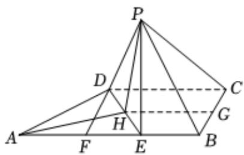

> [!faq]- 2024-2025学年内蒙古通辽市高一（下）期末数学试卷解析
>
> > [!success]- **【答案】** 详见解析
>
> > [!note]- **【解析】**
> > 详见解析
> >
> > 
> >
> > (1)证明：取BC的中点G，DE中点H，连结PG，GH，HP，
> > ∴HG//DC，
> > 又DC//AB,∴HG//AB，
> > ∵AB⊥BC,∴HG⊥BC，
> > 又∵PB=PC,∴PG⊥BC，
> > 又HG∩PG=G,∴BC⊥平面PGH，则PH⊥BC，
> > ∵PD=PE,H为DE中点，PH⊥DE，
> > 而BC与DE不平行，∴PH⊥平面ABCD，
> > ∵PH⊂平面PDE，
> > ∴平面PDE⊥平面ABCD；
> > (2)由（1）知，PH⊥平面ABCD，
> > 在直角梯形ABCD中，过D作DF⊥AB，
> > ∵AB=AE+EB=3，DC=2，AD=2，
> > ∴D到AB的距离DF= $\sqrt{3}$ 则 $S_{四边形BCDE}=\frac{1}{2}\times(1+2)\times\sqrt{3}=\frac{3\sqrt{3}}{2}$ 在Rt△DFE中，求得DE=2，则△ADE为等边三角形，
> > 可得AH= $\sqrt{3}$ ，即PH= $\sqrt{3}$ .
> > ∴ $V_{P-EBCD}=\frac{1}{3}\times\frac{3\sqrt{3}}{2}\times\sqrt{3}=\frac{3}{2}$
