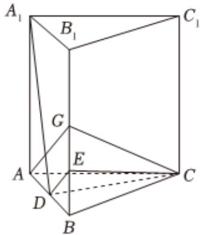

<!-- question-source:start -->
4、某次答辩活动有4道题目，第1题1分，第2题2分，第3题3分，第4题4分，每道题目答对给满分，答错不给分，甲参加答辩活动，每道题都要回答，答对第1，2，3，4题的概率分别为 $\frac{1}{2}$ ， $\frac{1}{3}$ ， $\frac{1}{4}$ ， $\frac{1}{5}$ ，且每道题目能否答对都是相互独立的.

1 求甲得10分的概率；

2 求甲得3分的概率；

3 若参加者的答辩分数大于6分，则答辩成功，求甲答辩成功的概率.

如图，在正三棱柱 $ABC-A_{1}B_{1}C_{1}$ 中，D，G分别为AB， $BB_{1}$ 的中点， $AA_{1}=AB=4,\overrightarrow{B_{1}E}=3\overrightarrow{EB}.$

1 证明： $DE \parallel$ 平面AGC；

2 证明： $A_{1}D \perp$ 平面CDE；

3 若点 $M$ 在 $\triangle DEC$ 的三边上运动，直线 $C_1M$ 与平面 $DEC$ 所成的角为 $\alpha$ ，求 $\tan \alpha$ 的取值范围.
<!-- question-source:end -->

![[Q00091058A1]]
