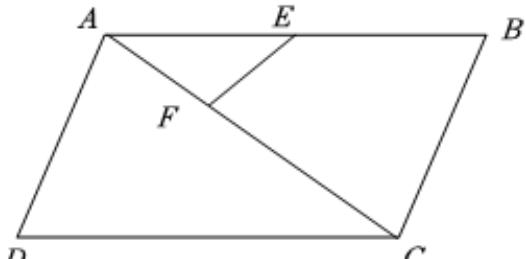

> [!faq]- 2024-2025学年内蒙古部分学校高一（下）期末数学试卷解析
>
> > [!success]- **【答案】** C
>
> > [!note]- **【解析】**
> > 如图， $\overrightarrow{AB} = 2\overrightarrow{AE}$ ， $\overrightarrow{AC} = 3\overrightarrow{AF}$
> >
> > 
> >
> > 所以 $\overrightarrow{AE} = \frac{1}{2}\overrightarrow{AB},\overrightarrow{AF} = \frac{1}{3}\overrightarrow{AC} = \frac{1}{3}\overrightarrow{AB} +\frac{1}{3}\overrightarrow{AD},$
> >
> > $$
> > \overrightarrow {E F} = \overrightarrow {A F} - \overrightarrow {A E} = \frac {1}{3} \overrightarrow {A B} + \frac {1}{3} \overrightarrow {A D} - \frac {1}{2} \overrightarrow {A B} = - \frac {1}{6} \overrightarrow {A B} + \frac {1}{3} \overrightarrow {A D}.
> > $$
> >
> > 故选：C.
