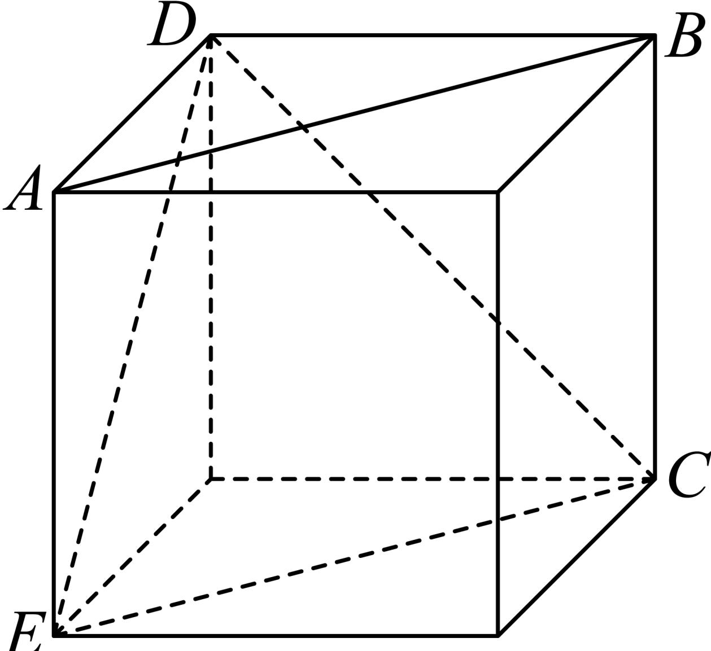

> [!faq]- 2024-2025学年内蒙古部分学校高一（下）期末数学试卷解析
>
> > [!success]- **【答案】** D
>
> > [!note]- **【解析】**
> > 正方体的展开图还原成正方体，如图，
> >
> > 
> >
> > 连接 $DE$ ， $CE$ ，由图知直线 $AB$ 与 $CD$ 异面，
> >
> > 在正方体中, $AB \parallel EC$ ,
> >
> > 则 $\angle ECD$ 为直线 $AB$ 与 $CD$ 所成角，
> >
> > 又 $DE = DB = EC$ ，则 $\triangle DCE$ 为等边三角形，即 $\angle ECD = \frac{\pi}{3}$
> >
> > ∴直线AB与CD异面，且直线AB与CD的夹角为 $\frac{\pi}{3}$ .
> >
> > 故选：D.
