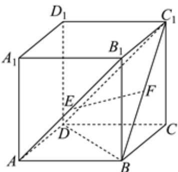

<!-- question-source:start -->
2、下列关于复数的结论正确的是（）
A 3 - 2i 的虚部是 -2i
B $\overline{z_{1}z_{2}} = \overline{z_{1}z_{2}}$ C $z^{2}=|z|^{2}$ D 方程 $x^{2}-2x+4=0$ 的根是 $x=1\pm\sqrt{3}i$

<!-- question-source:end -->

![[Q00091927A1]]
