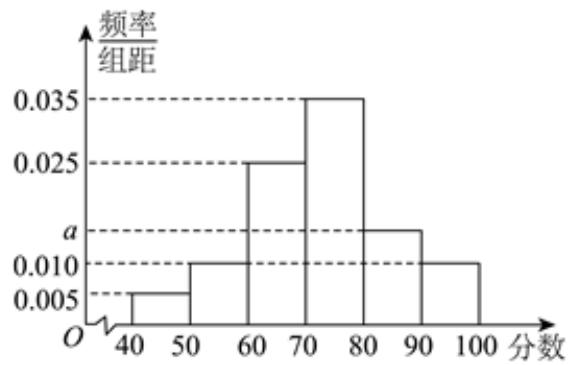

<!-- question-source:start -->
2、

某公司为了解员工对食堂的满意程度，随机抽取了200名员工做了一次问卷调查，要求员工对食堂的满意程度进行打分，所得分数均在[40,100]内，将所得数据分成6组：[40,50)，[50,60)，[60,70)，[70,80)，[80,90)，[90,100]，并得到如图所示的频率分布直方图.

求 $a$ 的值，并估计这200名员工所得分数的平均数（同一组中的数据用该组区间的中点值代表）和中位数（精确到0.1）；

2
现从[70, 80), [80, 90), [90, 100]这三组中用比例分配的分层随机抽样的方法抽取24人，求[70, 80)这组中抽取的人数.

<!-- question-source:end -->

![[Q00091933A1]]
