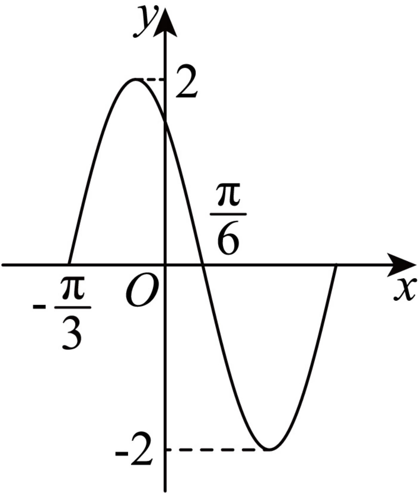

<!-- question-source:start -->
3、
函数 $f(x)$  在一个周期内的图象如图所示.
 $= A \sin (\omega x + \varphi)$ $(A &gt; 0, \omega &gt; 0, 0 &lt; \varphi &lt; \pi)$

1 求 $f(x)$ 的解析式；

2 将 $f(x)$ 的图象向左平移 $\frac{\pi}{3}$ 个单位长度后得到函数 $g(x)$ 的图象，求 $g(x)$ 在区间 $\left[-\frac{\pi}{12}, \frac{\pi}{2}\right]$ 上的最大值和最小值.
<!-- question-source:end -->

![[Q00091934A1]]
