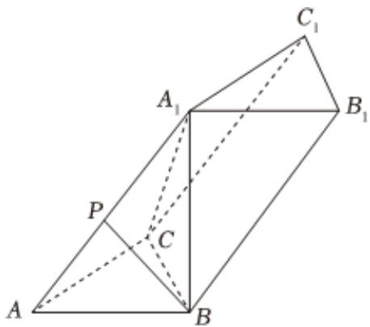

<!-- question-source:start -->
5、

如图，在三棱柱ABC- $A_{1}B_{1}C_{1}$ 中，底面ABC是边长为3的等边三角形， $AA_{1}=A_{1}C=5$ ， $A_{1}B=4$ 。

1 证明： $A_{1}B \perp$ 平面ABC；

2 求二面角A-BC-B $_{1}$ 的正弦值；

3 若点P是棱AA $_{1}$ 上的动点（包括端点），求直线BP与平面BB $_{1}$ C $_{1}$ C所成角的正弦值的取值范围．
<!-- question-source:end -->

![[Q00091936A1]]
