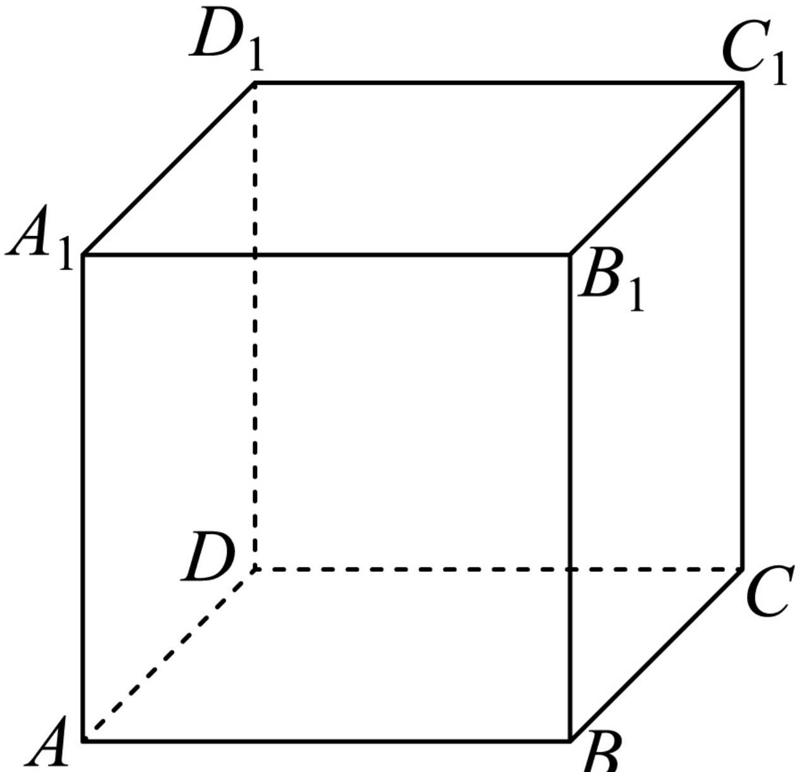

> [!faq]- 2024-2025学年内蒙古鄂尔多斯市西四旗高一（下）期末数学试卷解析
>
> > [!success]- **【答案】** C
>
> > [!note]- **【解析】**
> > 若 $\alpha // m, \beta // m$ ，则 $\alpha$ 与 $\beta$ 可以成 $(0, \frac{\pi}{2}]$ 的任意角，所以 $A$ 选项错误；
> >
> > 若 $m \parallel n, m \parallel \alpha, n \parallel \beta$ , 则 $\alpha \parallel \beta$ 可以成 $(0, \frac{\pi}{2}]$ 的任意角，所以 B 选项错误；
> >
> > 若 $m \parallel n, m \perp \alpha, n \perp \beta,$ 则 $\alpha \parallel \beta$ ，所以C选项正确；
> >
> > 如图，
> >
> > 
> >
> > 因为 $AB \parallel$ 平面 $A_{1}B_{1}C_{1}D_{1}$ , $A_{1}D_{1} \parallel$ 平面 $BCC_{1}B_{1}$ , 且 $AB$ 与 $A_{1}\overline{D_{1}}$ 是异面直线, 但平面 $A_{1}B_{1}C_{1}D_{1}$ 与平面 $BCC_{1}B_{1}$ 不平行, 所以 $D$ 选项错误; 故选: $C$ .
