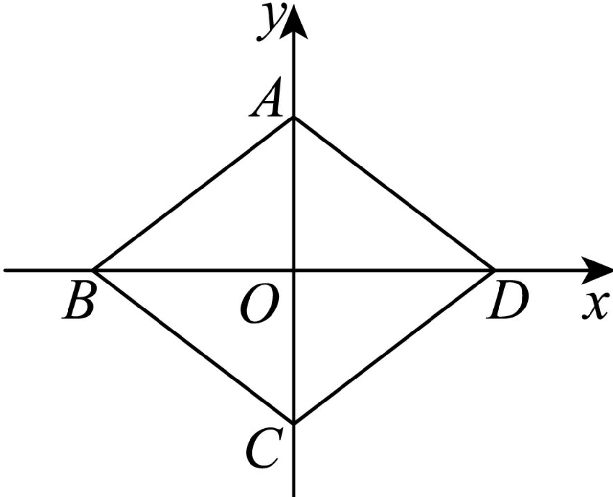

> [!faq]- 2024-2025学年内蒙古鄂尔多斯市西四旗高一（下）期末数学试卷解析
>
> > [!success]- **【答案】** D
>
> > [!note]- **【解析】**
> > 因为四边形ABCD为菱形，
> >
> > 所以 $AC \perp BD$ ，设 $BD = 2a$ ， $AC = 2b$
> >
> > 建立如图所示的平面直角坐标系，设 $P(x,y)$
> >
> > 
> >
> > 则 $B(-a,0)$ ， $D(a,0)$ ， $A(0,b)$ ， $C(0,-b)$ ，
> >
> > 所以 $\overrightarrow{PA} = (-x, b - y)$ , $\overrightarrow{PD} = (a - x, -y)$ ,
> >
> > $$
> > \overrightarrow {P B} = (- a - x, - y), \overrightarrow {P C} = (- x, - b - y)
> > $$
> >
> > $$
> > \overrightarrow {P A} + \overrightarrow {P D} = (a - 2 x, b - 2 y), \overrightarrow {P B} + \overrightarrow {P C} = (- a - 2 x, - b - 2 y)
> > $$
> >
> > 所以 $(\overrightarrow{PA} +\overrightarrow{PD})\cdot (\overrightarrow{PB} +\overrightarrow{PC})$
> >
> > $$
> > = (a - 2 x) (- a - 2 x) + (b - 2 y) (- b - 2 y)
> > $$
> >
> > $$
> > = 4 x ^ {2} + 4 y ^ {2} - a ^ {2} - b ^ {2}
> > $$
> >
> > $\geqslant -a^{2} - b^{2} = -AB^{2}$ ，当且仅当 $x = y = 0$ 时，
> >
> > 即点P为坐标原点时，等号成立.
> >
> > 此时 $-AB^{2} = -9$ ，解得 $AB = 3$
> >
> > 故选：D.
