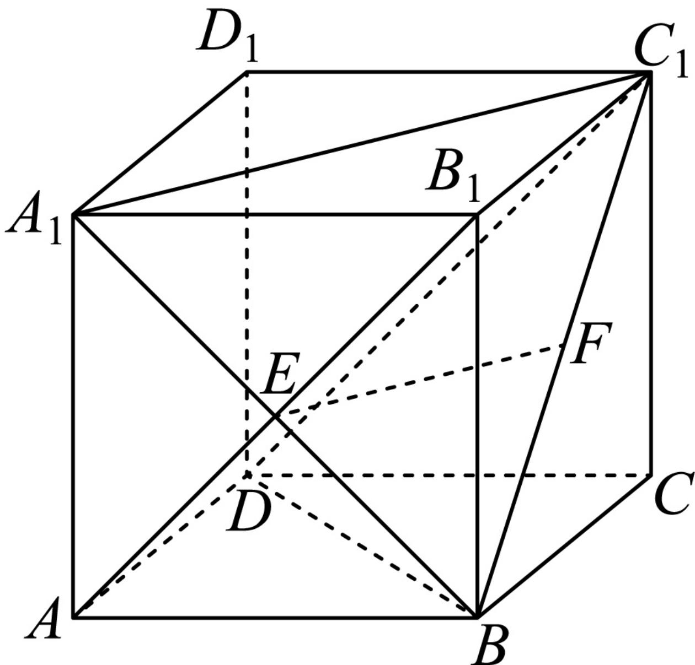

> [!faq]- 2024-2025学年内蒙古鄂尔多斯市西四旗高一（下）期末数学试卷解析
>
> > [!success]- **【答案】** BCD
>
> > [!note]- **【解析】**
> > 对A：连接 $A_{1}B$ ， $A_{1}C_{1}$ ，则 $A_{1}B$ 交 $AB_{1}$ 于E，
> >
> > 又 $F$ 为 $BC_{1}$ 中点，可得 $EF \parallel A_{1}C_{1}$ ，即 $EF \parallel AC$
> >
> > 但 $AC$ 与 $AB_{1}$ 不垂直，故 $\pmb{A}$ 错误；
> >
> > 对B：由 $EF \parallel AC$ ， $EF \neq$ 平面ABCD， $AC \subset$ 平面ABCD，
> >
> > 故 $EF \parallel$ 平面ABCD；故B正确；
> >
> > 对 $C$ ：由于 $AB_{1} \parallel DC_{1}$ ，故 $\angle BC_{1}D$ 就是异面直线 $BC_{1}$ 与 $AB_{1}$ 所成的角或其补角，
> >
> > 由正方体可知 $BD = DC_{1} = BC_{1}$ ，即 $\triangle BC_1D$ 为等边三角形，
> >
> > 故 $\angle BC_{1}D = \frac{\pi}{3}$ ，即异面直线 $BC_{1}$ 与 $AB_{1}$ 所成的角为 $\frac{\pi}{3}$ ，故 $C$ 正确；
> >
> > 对D：由于 $AB_{1} \parallel C_{1}D$ ， $C_{1}D \not\subset$ 平面 $BC_{1}D$ ， $AB_{1} \subset$ 平面 $BC_{1}D$ ，故 $AB_{1} \parallel$ 平面 $BC_{1}D$ ，
> >
> > 所以点 $E$ 到平面 $BC_{1}D$ 的距离等于点 $A$ 到平面 $BC_{1}D$ 的距离，
> >
> > 设点A到平面 $BC_{1}D$ 的距离为d，
> >
> > 由等体积法可知， $V_{C_1 - ABD} = V_{A - BC_1D}$ ，即 $\frac{1}{3} S_{\triangle ABD}\bullet CC_1 = \frac{1}{3} S_{\triangle BC_1D}\bullet d$
> >
> > 则
> >
> > 
> >
> > $d = \frac{S_{\triangle ABD} \bullet CC_1}{S_{\triangle BC_1D}} = \frac{\frac{1}{2} \times 1 \times 1 \times 1}{\frac{1}{2} \times \sqrt{2} \times (\frac{\sqrt{3}}{2} \times \sqrt{2})} = \frac{\sqrt{3}}{3}$ ，故 $D$ 正确.
> >
> > 故选：BCD.
