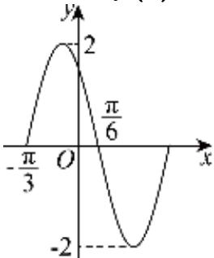

> [!faq]- 2024-2025学年内蒙古鄂尔多斯市西四旗高一（下）期末数学试卷解析
>
> > [!success]- **【答案】** 详见解析
>
> > [!note]- **【解析】**
> > 详见解析
> >
> > (1) 函数 $f(x) = A \sin(\omega x + \varphi) (A > 0, \omega > 0, 0 < \varphi < \pi)$ 在一个周期内的图象如图所示，
> >
> > 
> >
> > 由最值得A=2，
> >
> > 由相邻两个对称中心之间的距离得 $\frac{T}{2} = \frac{\pi}{6} -\left(-\frac{\pi}{3}\right) = \frac{\pi}{2}$ ，则 $T = \frac{2\pi}{\omega} = \pi$ ，即 $\omega = 2$
> >
> > 此时 $f(x)=2\sin(2x+\varphi)$
> >
> > $f(x)$ 图象的一个最高点坐标为 $\left(-\frac{\pi}{12}, 2\right)$ ，代入 $f(x) = 2\sin (2x + \varphi)$ 得 $sin\left(-\frac{\pi}{6} + \varphi\right) = 1$ ，
> >
> > 则 $-\frac{\pi}{6} + \varphi = \frac{\pi}{2} + 2k\pi (k \in Z)$ ，即 $\varphi = \frac{2\pi}{3} + 2k\pi (k \in Z)$
> >
> > 又因为 $0 < \varphi < \pi$ ，所以 $\pmb{k} = 0, \varphi = \frac{2\pi}{3}$
> >
> > 故函数的解析式为 $f(x) = 2\sin \left(2x + \frac{2\pi}{3}\right)$ ;
> >
> > (2)将 $f(x)$ 的图象向左平移 $\frac{\pi}{3}$ 个单位长度后得到函数 $g(x)$ 的图象，由题意得 $g(x) = 2\sin [2(x + \frac{\pi}{3}) + \frac{2\pi}{3}] = 2\sin (2x + \frac{4\pi}{3}) = 2\sin (2x - \frac{2\pi}{3})$ ，因为 $x\in [-\frac{\pi}{12},\frac{\pi}{2} ]$ ，所以 $2x - \frac{2\pi}{3}\in [-\frac{5\pi}{6},\frac{\pi}{3} ]$ 又 $y = \sin x$ 在 $[- \frac{5\pi}{6}, - \frac{\pi}{2} ]$ 上单调递减，在 $[- \frac{\pi}{2},\frac{\pi}{3} ]$ 上单调递增，所以当 $2x - \frac{2\pi}{3} = -\frac{\pi}{2}$ ，即 $x = \frac{\pi}{12}$ 时， $g(x)$ 取到最小值，为一2；当 $2x - \frac{2\pi}{3} = \frac{\pi}{3}$ 时，即 $x = \frac{\pi}{2}$ 时， $g(x)$ 取到最大值，为 $\sqrt{3}$
