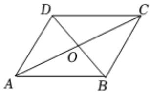

<!-- question-source:start -->
1、如图，设 $O$ 是平行四边形ABCD两对角线的交点，有下列向量组，可作为该平面内的其他向量基底的是（）

A $\overrightarrow{AD}$ 与 $\overrightarrow{AB}$ B $\overrightarrow{DA}$ 与 $\overrightarrow{BC}$ C $\overrightarrow{CA}$ 与 $\overrightarrow{DC}$ D $\overrightarrow{OD}$ 与 $\overrightarrow{OB}$
<!-- question-source:end -->

![[Q00091085A1]]
