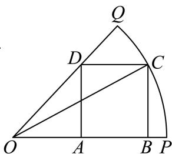

<!-- question-source:start -->
3、如图，OPQ是半径为1， $\angle POQ = \alpha$ 的扇形，C是弧上的动点，四边形ABCD是扇形的内接矩形，记 $\angle COP = x$ ， $cos\alpha = \frac{3}{5}$ ，当 $x = \theta$ 时，四边形ABCD的面积S取得最大值，则 $\cos\theta$ 的值为\_\_\_\_.

<!-- question-source:end -->

![[Q00091090A1]]
