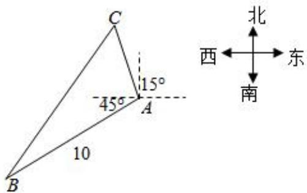

<!-- question-source:start -->
3、甲船在A处遇险，在甲船西南10海里B处的乙船收到甲船的求救信号后，测得甲船正沿着北偏西 $15^{\circ}$ 的方向，以每小时9海里的速度向某岛靠近。如果乙船要在40分钟内追上甲船，问乙船应以多大速度、向何方向航行？(注： $\sin21^{\circ}47'=\frac{3\sqrt{3}}{14}$ )。

<!-- question-source:end -->

![[Q00091093A1]]
