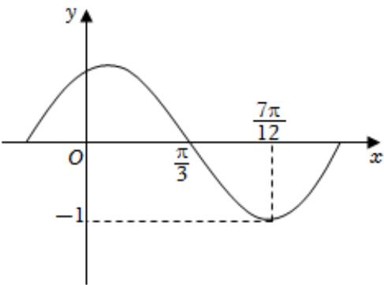

<!-- question-source:start -->
5、

函数 $f(x)=A\cos(\omega x+\varphi)$ （其中A>0， $\omega>0$ ， $|\varphi|<\frac{\pi}{2}$ ）的部分图象如图所示，先把函数 $f(x)$ 的图象上的各点的横坐标缩短为原来的 $\frac{1}{2}$ （纵坐标不变），把得到的曲线向左平移 $\frac{\pi}{4}$ 个单位长度，再向上平移1个单位，得到函数 $g(x)$ 的图象.

1 求函数 $g(x)$ 图象的对称中心.

2 当 $x \in [-\frac{\pi}{8}, \frac{\pi}{8}]$ 时，求 $g(x)$ 的值域.

3 当 $x \in [-\frac{\pi}{8}, \frac{\pi}{8}]$ 时，方程 $g^2(x) + (2 - m)g(x) + 3 - m = 0$ 有解，求实数 $m$ 的取值范围.
<!-- question-source:end -->

![[Q00091095A1]]
