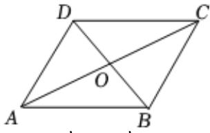

> [!faq]- 2024-2025学年内蒙古锡林郭勒盟二中高一（下）期中数学试卷解析
>
> > [!success]- **【答案】** AC
>
> > [!note]- **【解析】**
> > 由题意作平行四边形ABCD，如下所示图：
> >
> > 
> >
> > 因为 $\overrightarrow{AD}$ 与 $\overrightarrow{AB}$ 不共线， $\overrightarrow{CA}$ 与 $\overrightarrow{DC}$ 不共线，
> >
> > 所以它们均可作为这个平行四边形所在平面的一组基底，
> >
> > $\overrightarrow{DA}$ 与 $\overrightarrow{BC}$ 共线， $\overrightarrow{OD}$ 与 $\overrightarrow{OB}$ 共线，
> >
> > 故这两组向量不能作为该平面的一组基底，
> >
> > 故选：AC.
