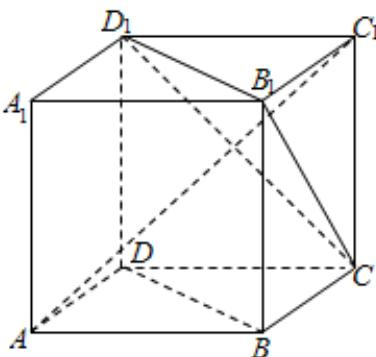

<!-- question-source:start -->
7、如图， $ABCD - A_{1}B_{1}C_{1}D_{1}$ 为正方体，下面结论错误的是（）A $BD / /$ 平面 $CB_{1}D_{1}$ B $AC_{1}\bot BD$ C $AC_{1}\bot$ 平面 $CB_{1}D_{1}$ D异面直线AD与 $CB_{1}$ 所成的角为 $60^{\circ}$

<!-- question-source:end -->

![[Q00091943A1]]
