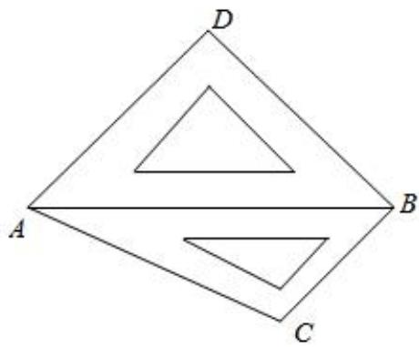

<!-- question-source:start -->
3、将一副斜边长相等的直角三角板拼接成如图所示的空间图形，其中 $AD = BD = \sqrt{2}$ ， $\angle BAC = 30^{\circ}$ ，若它们的斜边 $AB$ 重合，让三角板 $ABD$ 以 $AB$ 为轴转动，则下列说法正确的是 \_\_\_\_.

①当平面ABD⊥平面ABC时，C、D两点间的距离为 $\sqrt{2}$ ；

②在三角板ABD转动过程中，总有 $AB\perp CD$ ；

③在三角板ABD转动过程中，三棱锥D-ABC体积的最大值为 $\frac{\sqrt{3}}{6}$ .

<!-- question-source:end -->

![[Q00091950A1]]
