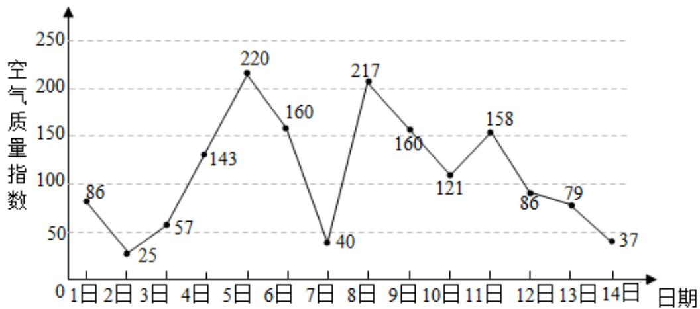

<!-- question-source:start -->
2、如图是某市3月1日至14日的空气质量指数趋势图.空气质量指数小于100表示空气质量优良，空气质量指数大于200表示空气重度污染.某人随机选择3月1日至3月13日中的某一天到达该市，并停留2天.

1 求此人到达当日空气质量优良的概率；

2 求此人在该市停留期间只有1天空气重度污染的概率；

3 由图判断从哪天开始连续三天的空气质量指数方差最大？(结论不要求证明)
<!-- question-source:end -->

![[Q00092490A1]]
