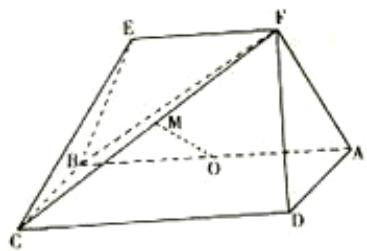
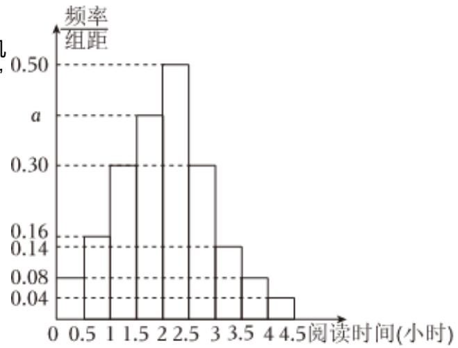

<!-- question-source:start -->
4. 如图，等腰梯形ABEF中， $AB//EF$ ，AB=2，

$AD = AF = 1AF \perp BF$ ， $O$ 为 $AB$ 的中点，矩形 $ABCD$ 所在的平面和平面 $ABEF$ 互相垂直.

1 求证： $AF \perp$ 平面CBF；

2 设 $FC$ 的中点为 $M$ ，求证： $OM//$ 平面 $DAF$ ；

## 3 求三棱锥C-BEF的体积.

某校为了解高一学生周末的“阅读时间”，从高一年级中随机调查了100名学生进行调查，获得了每人的周末“阅读时间”（单位：小时），按照 $[0,0.5)$ ， $[0.5,1)$ ，…， $[4,4.5]$ 分成9组，制成样本的频率分布直方图如图所示.

1 求图中a的值；

2 估计该校高一学生周末“阅读时间”的中位数；

3

采用分层抽样的方法从[1, 1.5)，[1.5, 2)这两组中抽取7人，再从7人中随机抽取2人，求抽取的2人恰好在同一组的概率.
<!-- question-source:end -->

![[Q00092492A1]]
