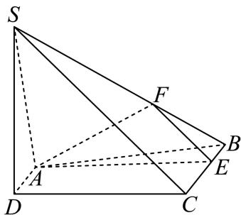

<!-- question-source:start -->
5、

如图，在四棱锥 $S - ABCD$ 中， $SA \perp$ 平面 $ABCD$ ，底面 $ABCD$ 为直角梯形， $AD \parallel BC, \angle BAD = 90^{\circ}$ ，且 $BC = 2AD, AB = 4, SA = 3$ .

1 求证：平面 $SBC \perp$ 平面SAB；

2

若 $E$ 、 $F$ 分别为线段 $BC$ 、 $SB$ 上的一点（端点除外），满足 $\frac{SF}{FB} = \frac{CE}{EB} = \lambda .$

①求证：不论 $\lambda$ 为何值，都有 $SC / /$ 平面 $AEF$ ；②是否存在 $\lambda$ ，使得 $\triangle AEF$ 为直角三角形，若存在，求出所有符合条件的 $\lambda$ 值；若不存在，说明理由.
<!-- question-source:end -->

![[Q00092493A1]]
